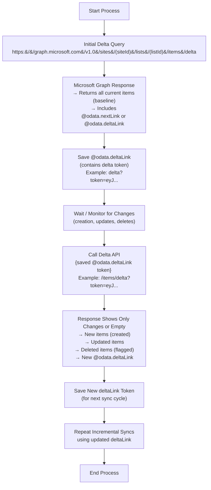

```mermaid
flowchart TD
    A["Start Process"] --> B["Initial Delta Query<br/>https:&#47;&#47;graph.microsoft.com&#47;v1.0&#47;sites&#47;(siteId)&#47;lists&#47;(listId)&#47;items&#47;delta"]
    B --> C["Microsoft Graph Response<br/>→ Returns all current items (baseline)<br/>→ Includes @odata.nextLink or @odata.deltaLink"]
    C --> D["Save @odata.deltaLink<br/>(contains delta token)<br/>Example: delta?token=eyJ..."]
    D --> E["Wait / Monitor for Changes<br/>(creation, updates, deletes)"]
    E --> F["Call Delta API<br/>{saved @odata.deltaLink token}<br/>Example: /items/delta?token=eyJ..."]
    F --> G["Response Shows Only Changes or Empty<br/>→ New items (created)<br/>→ Updated items<br/>→ Deleted items (flagged)<br/>→ New @odata.deltaLink"]
    G --> H["Save New deltaLink Token<br/>(for next sync cycle)"]
    H --> I["Repeat Incremental Syncs<br/>using updated deltaLink"]
    I --> J["End Process"]
```
